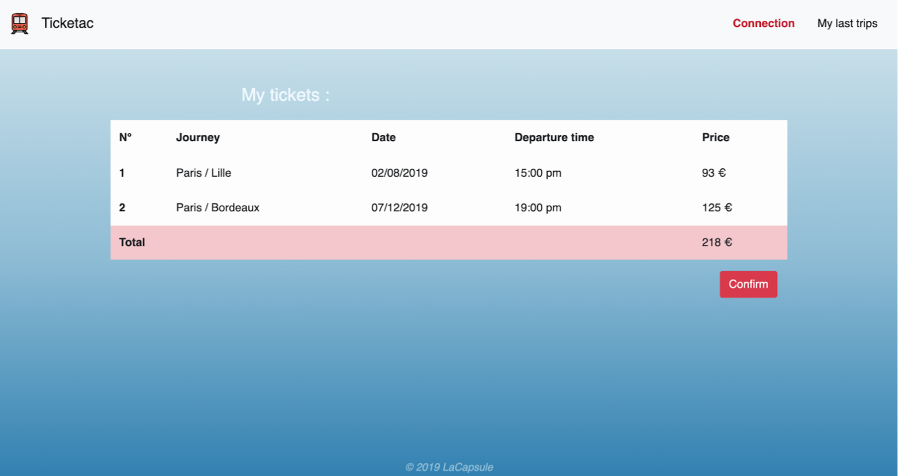

<div align="center" id="top"> 
  
  <h1>Ticketac</h1>

  &#xa0;


</div>


<p align="center">
  
  
  
  

  <!--  -->


  <!--  -->
</p>

<!-- Status -->

<!-- <h4 align="center"> 
	🚧  Ticketac 🚀 Under construction...  🚧
</h4> 

<hr> -->

<p align="center">
  <a href="#dart-about">About</a> &#xa0; | &#xa0; 
  <a href="#sparkles-features">Features</a> &#xa0; | &#xa0;
  <a href="#rocket-technologies">Technologies</a> &#xa0; | &#xa0;
  <a href="#white_check_mark-requirements">Requirements</a> &#xa0; | &#xa0;
  <a href="#checkered_flag-starting">Starting</a> &#xa0; | &#xa0;
  <a href="#memo-credits">Credits</a> &#xa0; | &#xa0;
  <a href="https://github.com/NDRBAX" target="_blank">Author</a>
</p>

<br>
<p align="center">



</p>

## :dart: About ##

Ticketac is a website for booking train tickets. 

## :sparkles: Features ##

:heavy_check_mark: When you arrive on the site you should see a Login page. The user must register to access the site.\
:heavy_check_mark: After selecting a date and clicking the Go button the user will be able to view the list of available tickets.\
:heavy_check_mark: The selected tickets will be displayed on a new page showing all the trips you have planned.\
:heavy_check_mark: In Nav, the My Last Trips tab should show all the trips you have made up to now, the trips are obviously specific to each User.

## :rocket: Technologies ##

The following tools were used in this project:

- [Node.js](https://nodejs.org/en/)
- [Express](https://expressjs.com/)
- [MongoDB](https://www.mongodb.com/)
- [Bootstrap](https://getbootstrap.com/)

## :white_check_mark: Requirements ##

Before starting :checkered_flag:, you need to have [Git](https://git-scm.com) and [Node](https://nodejs.org/en/) installed.

## :checkered_flag: Starting ##

```bash
# Clone this project
$ git clone https://github.com/NDRBAX/ticketac

# Access
$ cd ticketac

# Install dependencies
$ npm install

# Run the project
$ npm start

# The server will initialize in the <http://localhost:3000>
```

## :memo: Credits ##
Project logo : <a href="https://www.flaticon.com/free-icons/train" title="train icons">Train icons created by Smashicons - Flaticon</a>\
Project realized during the <a href="https://www.lacapsule.academy/">La Capsule Academy</a> bootcamp\
Made with :heart: by <a href="https://github.com/NDRBAX" target="_blank">NDRBAX</a> and <a href="https://github.com/Charlie7002" target="_blank">Charlotte C.</a>

&#xa0;

<a href="#top">Back to top</a>
